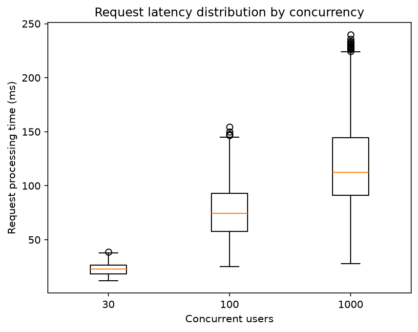
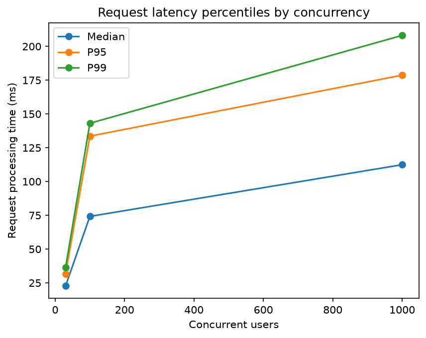

# Observability Baseline

## Purpose

Before introducing structured logging, I exercised the API using a simple client script to establish a baseline for the application's behaviour and output.

## Example Output

```text
Received request: GET /jobs
INFO:     127.0.0.1:50589 - "GET /jobs HTTP/1.1" 200 OK
Received request: GET /jobs/001
Found job: 001
INFO:     127.0.0.1:50589 - "GET /jobs/001 HTTP/1.1" 200 OK
Received request: GET /jobs/999
Job not found: 999
INFO:     127.0.0.1:50589 - "GET /jobs/999 HTTP/1.1" 404 Not Found
Received request: POST /jobs
Job created successfully: job_id='003' job_type='simulated' job_message='Hello'
INFO:     127.0.0.1:50589 - "POST /jobs HTTP/1.1" 201 Created
Received request: PUT /jobs/003
Updated job: 003 with message: Updated
INFO:     127.0.0.1:50589 - "PUT /jobs/003 HTTP/1.1" 200 OK
Received request: DELETE /jobs/003
Deleted job: 003
INFO:     127.0.0.1:50589 - "DELETE /jobs/003 HTTP/1.1" 200 OK
Received request: DELETE /jobs/999
Job not found: 999
INFO:     127.0.0.1:50589 - "DELETE /jobs/999 HTTP/1.1" 404 Not Found
```

### Observations

- Uvicorn provides access logs

## Simulated Traffic

The initial deterministic API calls were replaced with a traffic simulation that randomly selects API operations and job IDs, and delays each request randomly between 0.2 and 1.0 seconds.

The simulation produced a mixture of successful and unsuccessful requests.

### Observations

- Repeated runs of the simulation highlighted the value of a way of distinguishing between different requests of the same type.

## Concurrent Traffic

The traffic simulation was modified to issue requests concurrently rather than sequentially.

### Observations

- Application log messages became interleaved, making it difficult to determine which messages belonged to the same request.
- Requests were completed in a different order from which they were initiated.
- The existing application logs do not provide a mechanism for explicitly correlating related messages with an individual request.

## Concurrent Traffic

The traffic simulation was modified to issue requests concurrently rather than sequentially. A single run was performed with 30 simulated users, with each user making one request.

### Script Output

The simulation began by initiating all 30 requests in user order:

```text
User 1 performing action delete_job
User 2 performing action create_job
User 3 performing action update_job
...
User 30 performing action get_job
```

However, the requests completed in a different order:

```text
User 1: DELETE /jobs/002 → 200
User 7: PUT /jobs/001 → 200
User 20: GET /jobs → 200
User 12: PUT /jobs/001 → 200
User 3: PUT /jobs/1000 → 404
...
User 13: POST /jobs → 201
User 25: DELETE /jobs/002 → 404
User 17: GET /jobs/001 → 200
User 11: GET /jobs/001 → 200
```

This demonstrates that with concurrent requests, **request completion order is not necessarily the same as request initiation order**.

The complete script output is available in [Basic script output](./log_output/print_logging/basic_script_output.md).

### API Output

The application logs also became interleaved as requests were processed concurrently, with uvicorn logs also starting to mix in:

```text
Received request: GET /jobs/001
Received request: GET /jobs/002
Job not found: 002
Received request: DELETE /jobs/002
Received request: GET /jobs/002
Found job: 001
Received request: GET /jobs/1000
Job not found: 002
Received request: DELETE /jobs/1000
INFO:     127.0.0.1:54414 - "PUT /jobs/001 HTTP/1.1" 200 OK
Received request: POST /jobs
Job not found: 1000
Job not found: 1000
```

The individual application messages can no longer be reliably associated with a particular request from the application output alone.

The complete API output is available in [Basic API output](./log_output/print_logging/basic_api_output.md).

### Observations

- Concurrent requests caused application log messages to become interleaved, making it difficult to associate related messages with an individual request.
- Some application log entries became malformed when multiple requests attempted to write to the log file concurrently.
- Request completion order differed from request initiation order.
- The existing application logs do not provide a mechanism for explicitly correlating messages belonging to the same request.

## Request ID Experiment

To address the correlation problem identified during concurrent traffic, a unique request ID was generated at the HTTP boundary using FastAPI middleware. The ID was then included in application-level log messages.

The same concurrent traffic simulation was run again.

### Example

Multiple requests were processed concurrently:

```text
81806ffe-c739-4508-877b-c94b7bc4b52a Received request: POST /jobs
07ad800c-8aa9-4da2-a19d-b8063e6351c2 Received request: POST /jobs
81806ffe-c739-4508-877b-c94b7bc4b52a Job created successfully: job_id='498' job_type='simulated' job_message='Hello'
07ad800c-8aa9-4da2-a19d-b8063e6351c2 Job created successfully: job_id='416' job_type='simulated' job_message='Hello'
```

Although messages from different requests are interleaved, the request ID makes it possible to associate related messages with the same request.

For example:

```text
81806ffe... → POST /jobs → job 498
07ad800c... → POST /jobs → job 416
```

### Observations

- Request IDs allow application log messages to be associated with an individual request.
- Interleaved messages from concurrent requests can now be distinguished from one another.
- The request ID is generated at the HTTP boundary, allowing it to be associated with the request independently of the endpoint being called.
- The Uvicorn access logs do not currently contain the application request ID, so the application logs and access logs remain separate sources of information.

The complete API output is available in [Request ID API output](./log_output/print_logging/request_id_api_output.md).

## Request Timing

Request processing time was added at the HTTP boundary using `time.perf_counter()`.
The measured duration was returned in the `X-Process-Time` response header.

Example client output:

```text
User 5: GET /jobs → 200 (6.10 ms)
User 3: POST /jobs → 201 (8.08 ms)
User 6: GET /jobs/002 → 200 (7.63 ms)
```

The complete timing output is available in [timing script output](./log_output/print_logging/timing_script_output.md)

### Observations

- Request processing time can now be measured at the HTTP boundary.
- The timing is returned to the client through the X-Process-Time response header.
- Timing information makes it possible to compare request behaviour under different traffic levels.
- A single average is unlikely to describe request behaviour completely, particularly when requests are processed concurrently.

## Concurrency Benchmark

To investigate how request processing time changed as concurrent traffic increased, the simulation was extended into a repeatable benchmark.

Three concurrency levels were tested:

| Concurrent users | Runs | Requests per run | Total requests |
| ---------------- | ---- | ---------------- | -------------- | --- |
| 30               |      | 10               | 30             | 300 |
| 100              | 10   | 100              | 1,000          |
| 1,000            | 10   | 1,000            | 10,000         |

The application state was reset before each benchmark run so that each run started from the same initial state.

Request-level processing times were recorded in [results.csv](../../benchmark_output/baseline_results.csv), while run-level completion information was recorded separately in [runs.csv](../../benchmark_output/baseline_runs.csv).

The benchmark was intentionally limited to the concurrency levels above. Higher concurrency was also attempted, but the client encountered an HTTP connection-pool timeout at 10,000 simulated users. This was recorded as an observed limitation rather than changing the client configuration to accommodate it.

## Results

The measured request processing times were:

| Concurrent users | Requests | Mean      | Median    | P95       | P99       |
| ---------------- | -------- | --------- | --------- | --------- | --------- |
| 30               | 300      | 22.66 ms  | 22.75 ms  | 31.84 ms  | 36.52 ms  |
| 100              | 1,000    | 77.16 ms  | 74.21 ms  | 133.58 ms | 143.12 ms |
| 1,000            | 10,000   | 118.26 ms | 112.45 ms | 178.74 ms | 208.14 ms |

## Latency Distribution

The box plots show the distribution of request processing times at each concurrency level. They provide more information than the mean alone by showing the median, spread, and potential outliers.



## Latency Percentiles

The percentile plot shows how median and tail latency changed as concurrency increased. P95 and P99 are included to show the behaviour of slower requests that would be hidden by the mean alone.



From 30 to 100 concurrent users:

- Mean processing time increased from 22.66 ms to 77.16 ms.
- Median processing time increased from 22.75 ms to 74.21 ms.
- P99 increased from 36.52 ms to 143.12 ms.

From 100 to 1,000 concurrent users:

- Mean processing time increased from 77.16 ms to 118.26 ms.
- Median processing time increased from 74.21 ms to 112.45 ms.
- P99 increased from 143.12 ms to 208.14 ms.

The relationship between concurrency and processing time is therefore not linear over the tested range.

### Observations

- Increasing concurrency increased request processing time.
- The largest relative increase occurred between 30 and 100 concurrent users.
- Higher concurrency also increased the spread of request processing times.
- Tail latency increased substantially, with P99 rising from 36.52 ms at 30 users to 208.14 ms at 1,000 users.
- The results demonstrate that average latency alone would not fully describe the behaviour of the API under concurrent traffic.
- The benchmark establishes a quantitative baseline that can be compared against future changes to the application.

At this stage, the benchmark establishes what happened, but not why it happened. The next investigation will identify the source of the observed latency increase and determine which parts of the request path become limiting as concurrency increases.
